# Diagrama de Classes UML - HospitalCore

```mermaid
classDiagram
    direction TB

    %% --- Definição das Classes ---

    class Pessoa {
        <<Abstract>>
        # string nome
        # string cpf
        + Pessoa(string n, string c)
        + virtual ~Pessoa()
        + virtual void exibirFicha() const = 0
        + string getNome() const
        + string getCpf() const
    }

    class Paciente {
        - string historicoMedico
        + Paciente(string n, string c, string hist)
        + void exibirFicha() const override
        + string getHistorico() const
        + void setHistorico(string hist)
    }

    class Medico {
        - string especialidade
        - string crm
        + Medico(string n, string c, string esp, string crm)
        + void exibirFicha() const override
        + string getEspecialidade() const
        + string getCrm() const
    }

    class IAgendavel {
        <<Interface>>
        + virtual DataHora obterDataHora() const = 0
        + virtual bool temConflito(DataHora outraData) const = 0
        + virtual string obterDescricaoAgendamento() const = 0
    }

    class IGerenciavel {
        <<Interface>>
        + virtual string obterIdentificador() const = 0
        + virtual string obterDescricao() const = 0
    }

    class Consulta {
        - DataHora dataHora
        - Paciente* paciente
        - Medico* medico
        + Consulta(Paciente* p, Medico* m, DataHora d)
        + DataHora obterDataHora() const
        + bool temConflito(DataHora outraData) const
        + string obterDescricaoAgendamento() const
        + Paciente* getPaciente() const
        + Medico* getMedico() const
    }

    class Internacao {
        - Paciente* paciente
        - string nomeAla
        - int idLeito
        - DataHora dataEntrada
        - DataHora dataSaida
        + Internacao(Paciente* p, string ala, int leito, DataHora entrada)
        + DataHora obterDataHora() const
        + bool temConflito(DataHora outraData) const
        + string obterDescricaoAgendamento() const
        + void setDataSaida(DataHora saida)
        + bool estaAinda() const
    }

    class AlaHospitalar {
        - string nomeAla
        - vector~unique_ptr~Leito~~ leitos
        + AlaHospitalar(string nome)
        + void adicionarLeito(int id)
        + Leito* buscarLeitoDisponivel()
        + void listarLeitos() const
        + string getNome() const
    }

    class Leito {
        - int idLeito
        - bool ocupado
        - Paciente* pacienteAlocado
        + Leito(int id)
        + bool estaOcupado() const
        + void ocupar(Paciente* p)
        + void desocupar()
        + int getId() const
        + Paciente* getPaciente() const
    }

    class SistemaGestao {
        - vector~unique_ptr~Pessoa~~ pessoas
        - vector~unique_ptr~AlaHospitalar~~ alas
        - vector~unique_ptr~Consulta~~ consultas
        - vector~unique_ptr~Internacao~~ internacoes
        + void adicionarPaciente(...)
        + void adicionarMedico(...)
        + void agendarConsulta(...)
        + void internarPaciente(...)
        + void darAltaPaciente(...)
        + void listarPacientes() const
        + void listarMedicos() const
        + void listarConsultas() const
        + void listarInternacoes() const
    }

    class ValidadorDados {
        <<Static>>
        + static bool validarCPF(string cpf)
        + static bool validarCRM(string crm)
        + static bool validarNome(string nome)
        + static bool validarData(int d, int m, int a)
        + static bool validarHora(int h)
        + static bool validarMinuto(int m)
        + static string formatarCPF(string cpf)
        + static string limparCPF(string cpf)
    }

    class GerenciadorArquivos {
        <<Static>>
        + static void salvarPacientes(SistemaGestao s)
        + static void salvarMedicos(SistemaGestao s)
        + static void salvarTudo(SistemaGestao s, PreferenciasUsuario p)
        + static void carregarTudo(SistemaGestao s, PreferenciasUsuario p)
    }

    class PreferenciasUsuario {
        - string nomeExibicao
        - string tema
        + PreferenciasUsuario()
        + string getNomeExibicao() const
        + string getTema() const
        + void setNomeExibicao(string nome)
        + void setTema(string tema)
        + bool ehTemaDarkModeAtivo() const
    }

    class HospitalExcecao {
        <<Abstract>>
        # string mensagem
        + virtual const char* what() const noexcept
    }

    class ValidacaoExcecao { }
    class CPFInvalidoExcecao { }
    class CRMInvalidoExcecao { }
    class NomeInvalidoExcecao { }
    class DataInvalidaExcecao { }
    class AgendamentoExcecao { }
    class LeitoExcecao { }
    class EntidadeNaoEncontradaExcecao { }

    class Menu {
        - SistemaGestao sistema
        - PreferenciasUsuario preferences
        - bool executando
        + Menu()
        + void executar()
        - void gerenciarPacientes()
        - void gerenciarMedicos()
        - void gerenciarConsultas()
        - void gerenciarInternacoes()
        - void gerenciarPreferences()
    }

    %% --- Herança de Pessoas (Polimorfismo 1) ---
    Pessoa <|-- Paciente
    Pessoa <|-- Medico

    %% --- Implementação de Interfaces ---
    IAgendavel <|.. Consulta
    IAgendavel <|.. Internacao

    %% --- Herança de Exceções (Polimorfismo 2) ---
    std.exception <|-- HospitalExcecao
    HospitalExcecao <|-- ValidacaoExcecao
    HospitalExcecao <|-- AgendamentoExcecao
    HospitalExcecao <|-- LeitoExcecao
    HospitalExcecao <|-- EntidadeNaoEncontradaExcecao
    ValidacaoExcecao <|-- CPFInvalidoExcecao
    ValidacaoExcecao <|-- CRMInvalidoExcecao
    ValidacaoExcecao <|-- NomeInvalidoExcecao
    ValidacaoExcecao <|-- DataInvalidaExcecao

    %% --- Relações de Agregação e Associação ---
    
    %% O SistemaGestao "gerencia" as entidades principais
    SistemaGestao o-- "1..*" Pessoa : "gerencia"
    SistemaGestao o-- "1..*" AlaHospitalar : "gerencia"
    SistemaGestao o-- "0..*" Consulta : "gerencia"
    SistemaGestao o-- "0..*" Internacao : "gerencia"

    %% Uma Consulta "refere-se a" um Paciente e um Medico
    Consulta "1" ..> "1" Paciente : "paciente"
    Consulta "1" ..> "1" Medico : "medico"

    %% Uma Internacao "refere-se a" um Paciente
    Internacao "1" ..> "1" Paciente : "paciente"

    %% Uma AlaHospitalar "contém" Leitos
    AlaHospitalar "1" o-- "1..*" Leito : "contem"
    
    %% Um Leito "aloca" um Paciente (ou nenhum)
    Leito "1" o-- "0..1" Paciente : "aloca"

    %% Menu usa SistemaGestao e PreferenciasUsuario
    Menu "1" *-- "1" SistemaGestao : "usa"
    Menu "1" *-- "1" PreferenciasUsuario : "usa"

    %% SistemaGestao usa ValidadorDados
    SistemaGestao ..> ValidadorDados : "valida"
    Menu ..> ValidadorDados : "valida"

    %% GerenciadorArquivos persiste dados
    GerenciadorArquivos ..> SistemaGestao : "persiste"
    GerenciadorArquivos ..> PreferenciasUsuario : "persiste"
```

## Resumo da Arquitetura

### Polimorfismo
1. **Herança de Pessoa**: `Paciente` e `Medico` herdam de `Pessoa` (classe abstrata)
2. **Interface IAgendavel**: `Consulta` e `Internacao` implementam a interface
3. **Hierarquia de Exceções**: Todas herdam de `HospitalExcecao`

### Padrões de Design
- **MVC**: `Menu` (View) → `SistemaGestao` (Controller) → Entidades (Model)
- **RAII**: Uso de `unique_ptr` para gerenciamento automático de memória
- **Factory Pattern**: Criação de pessoas através do `SistemaGestao`
- **Strategy Pattern**: Validações através de `ValidadorDados`

### Persistência
- `GerenciadorArquivos` salva/carrega dados em CSV (pasta `build/dados/`)
- `PreferenciasUsuario` armazena configurações do usuário

### Validação
- `ValidadorDados`: validação centralizada (CPF, CRM, nome, data, hora, etc.)
- Exceções customizadas para diferentes tipos de erro